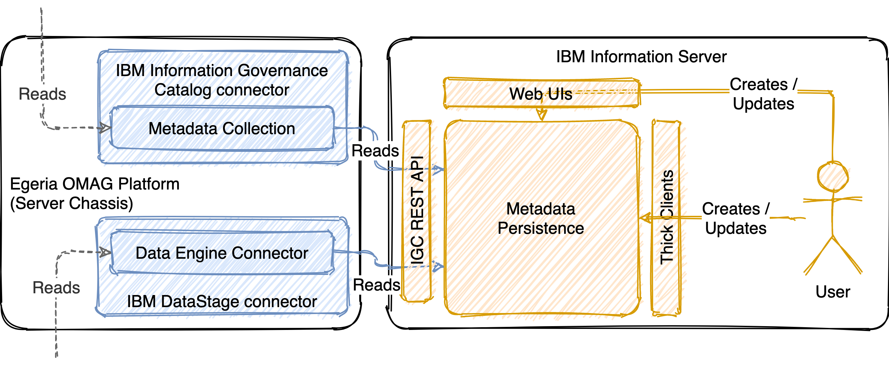

<!-- SPDX-License-Identifier: CC-BY-4.0 -->
<!-- Copyright Contributors to the ODPi Egeria project. -->

# DataStage Adapter

## Integrating with Egeria

The IBM DataStage connector is implemented as a data engine proxy that runs through the
Egeria OMAG Platform (server chassis). It does so by being implemented as a Data Engine
Connector and implementing the methods defined by this connector's interface.

## Integrating with DataStage

Just like the IBM Information Governance Catalog connector, all communication occurs through
IBM Information Server's REST API and the connector _only supports reading metadata_.
All write operations can only be done by a user directly through IBM Information Server's
supported web UIs or thick clients.

## Capabilities

!!! attention "Read-only data engine proxy connector"

!!! attention "Poll-based change retrieval (no events)"

!!! success "Integrates column-level lineage information from IBM Information Server"

!!! success "Creates a process hierarchy in Egeria"
    - each sequence is a process
    - each job is a process, with each sequence it appears in as a parent process
    - each stage is a process, with the job it is contained in as a parent process

!!! success "Configurable operation"
    - inclusion / exclusion of virtual assets
    - maximum window of changes to include in each poll

## Limitations

!!! danger "Unable to detect or communicate the deletion of jobs"

!!! warning "Some specific elements and scenarios may not yet be handled"
    For example:

    - shared containers
    - nested sequences
    - routines
    - custom operators

--8<-- "snippets/abbr.md"
