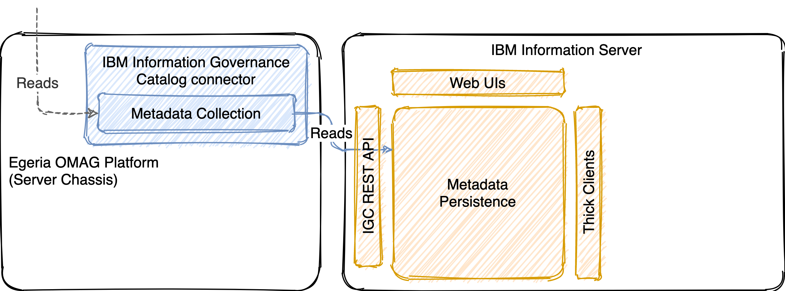

<!-- SPDX-License-Identifier: CC-BY-4.0 -->
<!-- Copyright Contributors to the ODPi Egeria project. -->

# IGC Adapter

## Integrating with Egeria

The IBM Information Governance Catalog connector is implemented as a repository proxy that
runs through the Egeria OMAG Platform (server chassis). It does so by being implemented as
an Open Metadata Repository Connector and implementing the repository-level methods defined
by the Metadata Collection interface.

## Integrating with IGC

The connector communicates with an existing IBM Information Server environment through its
REST API. Note that the connector _only supports reading metadata_ from Information
Server and is unable to create or update any metadata. Write operations can only be done
by a user directly through IBM Information Server's supported web UIs or thick clients.

## Capabilities

!!! attention "Read-only open metadata repository connector"

!!! success "Conformant to the mandatory CTS profile (metadata sharing)"
    including some additional search operations

!!! success "Common metadata entities are pre-mapped"
    - Database information (host, database, schema, table, column)
    - File information (host, folder, file, record, field)
    - Glossary information (category, term)

!!! success "Common relationships are pre-mapped"
    - Technical metadata containment (for the entities above)
    - Technical / business metadata relationships (ie. semantic assignment)

!!! attention "Some classifications are pre-defined"
    Although this is done through specific code and implementation choices, and may
    not be as-desired depending on the existing implementation of IGC in an organization.

!!! success "Designed to be [extensible](../../reference/extending/)"
    Without needing to fork the connector and modify code inline: extend with only what you need, re-using
    the base connector as-is (including any future enhancements, bug fixes, additions, etc).

## Limitations

!!! attention "Does not handle any create, update or delete operations from the rest of the cohort"

!!! danger "Does not provide an event mapper"
    No notification of metadata creation, changes or deletions via IGC's API or user interface
    are propagated out to the cohort: the connector only supports federated queries and retrieval
    through the metadata collection interface (APIs).

## Implemented mappings

The following types are currently mapped from IGC to OMRS. Note that there are currently no
mappings from OMRS types to IGC types as this connector is entirely read-only (not capable of
adding metadata _to_ IGC).

Hoping for a mapping that isn't there?

- [Submit an issue](https://github.com/odpi/egeria-connector-ibm-information-server/issues/new){ target=issue }, or
- Check out any of the linked code below for examples of what's needed to create a mapping,
  and create your own (and feel free to submit a PR with the result!)

### Mapped entities

| IGC type(s) | OMRS type(s) |
| :--- | :--- |
| `category` | [Glossary](https://github.com/odpi/egeria-connector-ibm-information-server/tree/main/igc-adapter/src/main/java/org/odpi/egeria/connectors/ibm/igc/repositoryconnector/mapping/entities/GlossaryMapper.java){ target=code }[^1], [GlossaryCategory](https://github.com/odpi/egeria-connector-ibm-information-server/tree/main/igc-adapter/src/main/java/org/odpi/egeria/connectors/ibm/igc/repositoryconnector/mapping/entities/GlossaryCategoryMapper.java){ target=code } |
| `connector` | [ConnectorType](https://github.com/odpi/egeria-connector-ibm-information-server/tree/main/igc-adapter/src/main/java/org/odpi/egeria/connectors/ibm/igc/repositoryconnector/mapping/entities/ConnectorTypeMapper.java){ target=code } |
| `data_class` | [DataClass](https://github.com/odpi/egeria-connector-ibm-information-server/tree/main/igc-adapter/src/main/java/org/odpi/egeria/connectors/ibm/igc/repositoryconnector/mapping/entities/DataClassMapper.java){ target=code } |
| `data_connection` | [Connection](https://github.com/odpi/egeria-connector-ibm-information-server/tree/main/igc-adapter/src/main/java/org/odpi/egeria/connectors/ibm/igc/repositoryconnector/mapping/entities/ConnectionMapper.java){ target=code } |
| `data_file` | [DataFile](https://github.com/odpi/egeria-connector-ibm-information-server/tree/main/igc-adapter/src/main/java/org/odpi/egeria/connectors/ibm/igc/repositoryconnector/mapping/entities/DataFileMapper.java){ target=code } |
| `data_file_field` | [TabularColumn](https://github.com/odpi/egeria-connector-ibm-information-server/tree/main/igc-adapter/src/main/java/org/odpi/egeria/connectors/ibm/igc/repositoryconnector/mapping/entities/TabularColumnMapper.java){ target=code } |
| `data_file_folder` | [FileFolder](https://github.com/odpi/egeria-connector-ibm-information-server/tree/main/igc-adapter/src/main/java/org/odpi/egeria/connectors/ibm/igc/repositoryconnector/mapping/entities/FileFolderMapper.java){ target=code } |
| `data_file_record` | [TabularSchemaType](https://github.com/odpi/egeria-connector-ibm-information-server/tree/main/igc-adapter/src/main/java/org/odpi/egeria/connectors/ibm/igc/repositoryconnector/mapping/entities/TabularSchemaTypeMapper.java){ target=code } |
| `database` | [Database](https://github.com/odpi/egeria-connector-ibm-information-server/tree/main/igc-adapter/src/main/java/org/odpi/egeria/connectors/ibm/igc/repositoryconnector/mapping/entities/DatabaseMapper.java){ target=code } |
| `database_column` | [RelationalColumn](https://github.com/odpi/egeria-connector-ibm-information-server/tree/main/igc-adapter/src/main/java/org/odpi/egeria/connectors/ibm/igc/repositoryconnector/mapping/entities/RelationalColumnMapper.java){ target=code } |
| `database_schema` | [DeployedDatabaseSchema](https://github.com/odpi/egeria-connector-ibm-information-server/tree/main/igc-adapter/src/main/java/org/odpi/egeria/connectors/ibm/igc/repositoryconnector/mapping/entities/DeployedDatabaseSchemaMapper.java){ target=code }, [RelationalDBSchemaType](https://github.com/odpi/egeria-connector-ibm-information-server/tree/main/igc-adapter/src/main/java/org/odpi/egeria/connectors/ibm/igc/repositoryconnector/mapping/entities/RelationalDBSchemaTypeMapper.java){ target=code } |
| `database_table` | [RelationalTable](https://github.com/odpi/egeria-connector-ibm-information-server/tree/main/igc-adapter/src/main/java/org/odpi/egeria/connectors/ibm/igc/repositoryconnector/mapping/entities/RelationalTableMapper.java){ target=code } |
| `host`, `host_(engine)` | [Endpoint](https://github.com/odpi/egeria-connector-ibm-information-server/tree/main/igc-adapter/src/main/java/org/odpi/egeria/connectors/ibm/igc/repositoryconnector/mapping/entities/EndpointMapper.java){ target=code } |
| `information_asset` | [NoteLog](https://github.com/odpi/egeria-connector-ibm-information-server/tree/main/igc-adapter/src/main/java/org/odpi/egeria/connectors/ibm/igc/repositoryconnector/mapping/entities/NoteLogMapper.java){ target=code }[^2] |
| `information_governance_policy` | [GovernancePolicy](https://github.com/odpi/egeria-connector-ibm-information-server/tree/main/igc-adapter/src/main/java/org/odpi/egeria/connectors/ibm/igc/repositoryconnector/mapping/entities/GovernancePolicyMapper.java){ target=code } |
| `label` | [InformalTag](https://github.com/odpi/egeria-connector-ibm-information-server/tree/main/igc-adapter/src/main/java/org/odpi/egeria/connectors/ibm/igc/repositoryconnector/mapping/entities/InformalTagMapper.java){ target=code } |
| `note` | [NoteEntry](https://github.com/odpi/egeria-connector-ibm-information-server/tree/main/igc-adapter/src/main/java/org/odpi/egeria/connectors/ibm/igc/repositoryconnector/mapping/entities/NoteEntryMapper.java){ target=code }[^3] |
| `term` | [GlossaryTerm](https://github.com/odpi/egeria-connector-ibm-information-server/tree/main/igc-adapter/src/main/java/org/odpi/egeria/connectors/ibm/igc/repositoryconnector/mapping/entities/GlossaryTermMapper.java){ target=code } |
| `user`, `group` | [ContactDetails](https://github.com/odpi/egeria-connector-ibm-information-server/tree/main/igc-adapter/src/main/java/org/odpi/egeria/connectors/ibm/igc/repositoryconnector/mapping/entities/ContactDetailsMapper.java){ target=code }, [Team](https://github.com/odpi/egeria-connector-ibm-information-server/tree/main/igc-adapter/src/main/java/org/odpi/egeria/connectors/ibm/igc/repositoryconnector/mapping/entities/TeamMapper.java){ target=code } |
| `user`, `steward_user`, `non_steward_user` | [Person](https://github.com/odpi/egeria-connector-ibm-information-server/tree/main/igc-adapter/src/main/java/org/odpi/egeria/connectors/ibm/igc/repositoryconnector/mapping/entities/PersonMapper.java){ target=code } |

### Mapped relationships

| IGC types and properties | OMRS type |
| :--- | :--- |
| `database_schema` - `database_schema` | [AssetSchemaType](https://github.com/odpi/egeria-connector-ibm-information-server/tree/main/igc-adapter/src/main/java/org/odpi/egeria/connectors/ibm/igc/repositoryconnector/mapping/relationships/AssetSchemaTypeMapper_DatabaseSchema.java){ target=code }[^4] |
| `data_file.data_file_records` - `data_file_record.data_file` | [AssetSchemaType](https://github.com/odpi/egeria-connector-ibm-information-server/tree/main/igc-adapter/src/main/java/org/odpi/egeria/connectors/ibm/igc/repositoryconnector/mapping/relationships/AssetSchemaTypeMapper_FileRecord.java){ target=code } |
| `information_asset` - `information_asset` | [AttachedNoteLog](https://github.com/odpi/egeria-connector-ibm-information-server/tree/main/igc-adapter/src/main/java/org/odpi/egeria/connectors/ibm/igc/repositoryconnector/mapping/relationships/AttachedNoteLogMapper.java){ target=code }[^5] |
| `information_asset.notes` - `note.belonging_to` | [AttachedNoteLogEntry](https://github.com/odpi/egeria-connector-ibm-information-server/tree/main/igc-adapter/src/main/java/org/odpi/egeria/connectors/ibm/igc/repositoryconnector/mapping/relationships/AttachedNoteLogEntryMapper.java){ target=code }[^6] |
| `information_asset.labels` - `label.labeled_assets` | [AttachedTag](https://github.com/odpi/egeria-connector-ibm-information-server/tree/main/igc-adapter/src/main/java/org/odpi/egeria/connectors/ibm/igc/repositoryconnector/mapping/relationships/AttachedTagMapper.java){ target=code } |
| `data_file_record.data_file_fields` - `data_file_field.data_file_record` | [AttributeForSchema](https://github.com/odpi/egeria-connector-ibm-information-server/tree/main/igc-adapter/src/main/java/org/odpi/egeria/connectors/ibm/igc/repositoryconnector/mapping/relationships/AttributeForSchemaMapper_RecordField.java){ target=code } |
| `database_table.database_columns` - `database_column.database_table_or_view` | [NestedSchemaAttribute](https://github.com/odpi/egeria-connector-ibm-information-server/tree/main/igc-adapter/src/main/java/org/odpi/egeria/connectors/ibm/igc/repositoryconnector/mapping/relationships/NestedSchemaAttributeMapper.java){ target=code } |
| `database_schema.database_tables` - `database_table.database_schema` | [AttributeForSchema](https://github.com/odpi/egeria-connector-ibm-information-server/tree/main/igc-adapter/src/main/java/org/odpi/egeria/connectors/ibm/igc/repositoryconnector/mapping/relationships/AttributeForSchemaMapper_TableSchema.java){ target=code } |
| `category.subcategories` - `category.parent_category` | [CategoryAnchor](https://github.com/odpi/egeria-connector-ibm-information-server/tree/main/igc-adapter/src/main/java/org/odpi/egeria/connectors/ibm/igc/repositoryconnector/mapping/relationships/CategoryAnchorMapper.java){ target=code }[^7] |
| `category.subcategories` - `category.parent_category` | [CategoryHierarchyLink](https://github.com/odpi/egeria-connector-ibm-information-server/tree/main/igc-adapter/src/main/java/org/odpi/egeria/connectors/ibm/igc/repositoryconnector/mapping/relationships/CategoryHierarchyLinkMapper.java){ target=code } |
| `data_connection.data_connectors` - `connector.data_connections` | [ConnectionConnectorType](https://github.com/odpi/egeria-connector-ibm-information-server/tree/main/igc-adapter/src/main/java/org/odpi/egeria/connectors/ibm/igc/repositoryconnector/mapping/relationships/ConnectionConnectorTypeMapper.java){ target=code } |
| `host.data_connections` - `connector.data_connections` - `data_connection.data_connectors` | [ConnectionEndpoint](https://github.com/odpi/egeria-connector-ibm-information-server/tree/main/igc-adapter/src/main/java/org/odpi/egeria/connectors/ibm/igc/repositoryconnector/mapping/relationships/ConnectionEndpointMapper.java){ target=code }[^8] |
| `data_connection.imports_database` - `database.data_connections` | [ConnectionToAsset](https://github.com/odpi/egeria-connector-ibm-information-server/tree/main/igc-adapter/src/main/java/org/odpi/egeria/connectors/ibm/igc/repositoryconnector/mapping/relationships/ConnectionToAssetMapper_Database.java){ target=code } |
| `data_connection` - `data_file_folder.data_connection` | [ConnectionToAsset](https://github.com/odpi/egeria-connector-ibm-information-server/tree/main/igc-adapter/src/main/java/org/odpi/egeria/connectors/ibm/igc/repositoryconnector/mapping/relationships/ConnectionToAssetMapper_FileFolder.java){ target=code } |
| `user` - `user` | [ContactThrough](https://github.com/odpi/egeria-connector-ibm-information-server/tree/main/igc-adapter/src/main/java/org/odpi/egeria/connectors/ibm/igc/repositoryconnector/mapping/relationships/ContactThroughMapper_Person.java){ target=code }[^9] |
| `group` - `group` | [ContactThrough](https://github.com/odpi/egeria-connector-ibm-information-server/tree/main/igc-adapter/src/main/java/org/odpi/egeria/connectors/ibm/igc/repositoryconnector/mapping/relationships/ContactThroughMapper_Team.java){ target=code }[^9] |
| `information_asset.detected_classifications` / `information_asset.selected_classification` - `classification` - `data_class.classified_assets_detected` / `data_class.classifications_selected` | [DataClassAssignment](https://github.com/odpi/egeria-connector-ibm-information-server/tree/main/igc-adapter/src/main/java/org/odpi/egeria/connectors/ibm/igc/repositoryconnector/mapping/relationships/DataClassAssignmentMapper.java){ target=code }[^10] |
| `data_class.contains_data_classes` - `data_class.parent_data_class` | [DataClassHierarchy](https://github.com/odpi/egeria-connector-ibm-information-server/tree/main/igc-adapter/src/main/java/org/odpi/egeria/connectors/ibm/igc/repositoryconnector/mapping/relationships/DataClassHierarchyMapper.java){ target=code } |
| `database.database_schemas` - `database_schema.database` | [DataContentForDataSet](https://github.com/odpi/egeria-connector-ibm-information-server/tree/main/igc-adapter/src/main/java/org/odpi/egeria/connectors/ibm/igc/repositoryconnector/mapping/relationships/DataContentForDataSetMapper.java){ target=code } |
| `data_file_folder.data_file_folders` - `data_file_folder.parent_folder` | [FolderHierarchy](https://github.com/odpi/egeria-connector-ibm-information-server/tree/main/igc-adapter/src/main/java/org/odpi/egeria/connectors/ibm/igc/repositoryconnector/mapping/relationships/FolderHierarchyMapper.java){ target=code } |
| `database_column.defined_foreign_key_referenced` / `database_column.selected_foreign_key_referenced` - `database_column.defined_foreign_key_references` / `database_column.selected_foreign_key_references` | [ForeignKey](https://github.com/odpi/egeria-connector-ibm-information-server/tree/main/igc-adapter/src/main/java/org/odpi/egeria/connectors/ibm/igc/repositoryconnector/mapping/relationships/ForeignKeyMapper.java){ target=code } |
| `information_governance_policy.subpolicies` - `information_governance_policy.parent_policy` | [GovernancePolicyLink](https://github.com/odpi/egeria-connector-ibm-information-server/tree/main/igc-adapter/src/main/java/org/odpi/egeria/connectors/ibm/igc/repositoryconnector/mapping/relationships/GovernancePolicyLinkMapper.java){ target=code } |
| `data_file_folder.data_files` - `data_file.parent_folder` | [NestedFile](https://github.com/odpi/egeria-connector-ibm-information-server/tree/main/igc-adapter/src/main/java/org/odpi/egeria/connectors/ibm/igc/repositoryconnector/mapping/relationships/NestedFileMapper.java){ target=code } |
| `term.related_terms` - `term.related_terms` | [RelatedTerm](https://github.com/odpi/egeria-connector-ibm-information-server/tree/main/igc-adapter/src/main/java/org/odpi/egeria/connectors/ibm/igc/repositoryconnector/mapping/relationships/RelatedTermMapper.java){ target=code } |
| `term.replaced_by` - `term.replaces` | [ReplacementTerm](https://github.com/odpi/egeria-connector-ibm-information-server/tree/main/igc-adapter/src/main/java/org/odpi/egeria/connectors/ibm/igc/repositoryconnector/mapping/relationships/ReplacementTermMapper.java){ target=code } |
| `information_asset.assigned_to_terms` - `term.assigned_assets` | [SemanticAssignment](https://github.com/odpi/egeria-connector-ibm-information-server/tree/main/igc-adapter/src/main/java/org/odpi/egeria/connectors/ibm/igc/repositoryconnector/mapping/relationships/SemanticAssignmentMapper.java){ target=code } |
| `term.synonyms` - `term.synonyms` | [Synonym](https://github.com/odpi/egeria-connector-ibm-information-server/tree/main/igc-adapter/src/main/java/org/odpi/egeria/connectors/ibm/igc/repositoryconnector/mapping/relationships/SynonymMapper.java){ target=code } |
| `category.terms` - `term.parent_category` | [TermAnchor](https://github.com/odpi/egeria-connector-ibm-information-server/tree/main/igc-adapter/src/main/java/org/odpi/egeria/connectors/ibm/igc/repositoryconnector/mapping/relationships/TermAnchorMapper.java){ target=code }[^11] |
| `category.terms` - `term.parent_category` | [TermCategorization](https://github.com/odpi/egeria-connector-ibm-information-server/tree/main/igc-adapter/src/main/java/org/odpi/egeria/connectors/ibm/igc/repositoryconnector/mapping/relationships/TermCategorizationMapper.java){ target=code } |
| `term.has_a_term` - `term.is_of` | [TermHASARelationship](https://github.com/odpi/egeria-connector-ibm-information-server/tree/main/igc-adapter/src/main/java/org/odpi/egeria/connectors/ibm/igc/repositoryconnector/mapping/relationships/TermHASARelationshipMapper.java){ target=code } |
| `term.has_types` - `term.is_a_type_of` | [TermISATypeOFRelationship](https://github.com/odpi/egeria-connector-ibm-information-server/tree/main/igc-adapter/src/main/java/org/odpi/egeria/connectors/ibm/igc/repositoryconnector/mapping/relationships/TermISATypeOFRelationshipMapper.java){ target=code } |
| `term.translations` - `term.translations` | [Translation](https://github.com/odpi/egeria-connector-ibm-information-server/tree/main/igc-adapter/src/main/java/org/odpi/egeria/connectors/ibm/igc/repositoryconnector/mapping/relationships/TranslationMapper.java){ target=code } |

### Mapped classifications

Because IGC has no "Classification" concept, the following are suggested implementations of
Classifications within IGC by overloading the use of other concepts. These can be changed to
alternative implementations simply by updating the linked mapping code to match your desired
implementation of the concept.

| OMRS type | IGC mapping logic |
| :--- | :--- |
| [AssetZoneMembership](https://github.com/odpi/egeria-connector-ibm-information-server/tree/main/igc-adapter/src/main/java/org/odpi/egeria/connectors/ibm/igc/repositoryconnector/mapping/classifications/AssetZoneMembershipMapper.java){ target=code } | The provided implementation simply assigns the list of default zones that have been [specified as `default.zones` in the configuration of the connector](../../getting-started/igc/#connector-options) to each `Database`, `DataFile`, `DeployedDatabaseSchema` and `FileFolder` in the IGC repository anytime these assets are retrieved. |
| [Confidentiality](https://github.com/odpi/egeria-connector-ibm-information-server/tree/main/igc-adapter/src/main/java/org/odpi/egeria/connectors/ibm/igc/repositoryconnector/mapping/classifications/ConfidentialityMapper.java){ target=code } | The provided implementation assigns a `Confidentiality` classification to a `GlossaryTerm` (only) using the `assigned_to_term` relationship from one `term` to any `term` within the `Classifications/Confidentiality` parent `category`. The terms contained within this _Confidentiality_ `category` in essence represent the `ConfidentialityLevel` enumeration in OMRS. With this implementation, any `assigned_to_term` relationship on a `term`, where the assigned `term` is within this _Confidentiality_ `category` in IGC, will be mapped to a `Confidentiality` classification in OMRS. |
| [PrimaryKey](https://github.com/odpi/egeria-connector-ibm-information-server/tree/main/igc-adapter/src/main/java/org/odpi/egeria/connectors/ibm/igc/repositoryconnector/mapping/classifications/PrimaryKeyMapper.java){ target=code } | The provided implementation looks for the presence of either the `defined_primary_key` or `selected_primary_key` properties on a `database_column`, and if present add a `PrimaryKey` classification to that `RelationalColumn`. |
| [SpineObject](https://github.com/odpi/egeria-connector-ibm-information-server/tree/main/igc-adapter/src/main/java/org/odpi/egeria/connectors/ibm/igc/repositoryconnector/mapping/classifications/SpineObjectMapper.java){ target=code } | The provided implementation assigns a `SpineObject` classification to a `GlossaryTerm` based on the `referencing_categories` of the `term` in IGC. Specifically, when the `term` has a `referencing_categories` link to `Classifications/SpineObject`, the `GlossaryTerm` to which that `term` maps will be assigned the `SpineObject` classification. |
| [SubjectArea](https://github.com/odpi/egeria-connector-ibm-information-server/tree/main/igc-adapter/src/main/java/org/odpi/egeria/connectors/ibm/igc/repositoryconnector/mapping/classifications/SubjectAreaMapper.java){ target=code } | The provided implementation assigns a `SubjectArea` classification to a `GlossaryCategory` based on the `assigned_to_term` relationship of the `category` in IGC. Specifically, when the `category` has an `assigned_to_term` relationship to the IGC `term` `Classifications/SubjectArea`, the `GlossaryCategory` will be assigned a `SubjectArea` classification whose `name` will match the name of the IGC `category`. |
| [TypeEmbeddedAttribute](https://github.com/odpi/egeria-connector-ibm-information-server/tree/main/igc-adapter/src/main/java/org/odpi/egeria/connectors/ibm/igc/repositoryconnector/mapping/classifications/TypeEmbeddedAttributeMapper.java){ target=code } | The provided implementation adds this classification to all `RelationTable`, `RelationalColumn` and `TabularColumn` instances to simplify the management of type information without requiring additional `SchemaType` subclasses (like `RelationalTableType`, `RelationalColumnType` and `TabularColumnType`) and their additional relationships. |

[^1]: All top-level categories in IGC that are _not_ named `Classifications` are considered a Glossary, all
      categories whose `parent_category` is not null and not `Classifications` are considered a GlossaryCategory.
[^2]: `NoteLog` is a generated entity, present only for those IGC objects that support notes, and it cannot be searched.
[^3]: `NoteEntry` cannot be searched, only retrieved from the NoteLog to which they are related.
[^4]: `AssetSchemaType` between `database_schema` objects is a generated relationship (all properties for both
      endpoints are on a single entity instance in IGC).
[^5]: `AttachedNoteLog` between `information_asset` objects is a generated relationship (all properties for both
      endpoints are on a single entity instance in IGC), and is only present on those IGC objects that support notes.
[^6]: `AttachedNoteLogEntry` relationship cannot be searched.
[^7]: `CategoryAnchor` relationship is between the ultimate parent IGC category (Glossary) and any offspring.
[^8]: `ConnectionEndpoint` is linked through IGC's `connector` object in the middle
[^9]: `ContactThrough` is a generated relationship (all properties for both endpoints are on a single entity instance
      in IGC).
[^10]: `DataClassAssignment` is linked through IGC's `classification` object in the middle, which has some
      relationship-specific properties.
[^11]: `TermAnchor` creates a relationship between the ultimate parent IGC category (Glossary) and an IGC term.

--8<-- "snippets/abbr.md"
